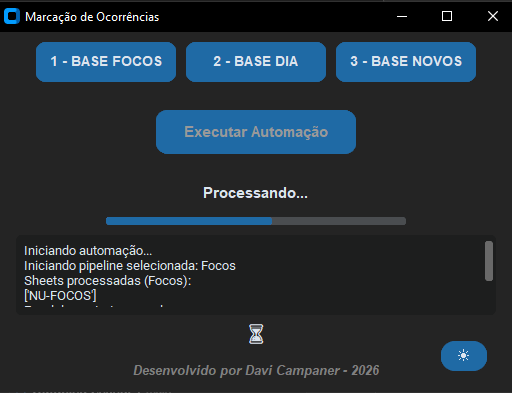

# 🚀 Automação de Marcação de Ocorrências – VCOM

Este projeto automatiza o processo de **geração, filtragem e importação de ocorrências no sistema VCOM**, reduzindo tarefas manuais e aumentando a confiabilidade do processo operacional.

A automação combina:

- processamento de dados em **Excel**
- **integração com SQL** para suporte a macros
- **automação web** para interação com o sistema VCOM
- **interface gráfica moderna** para execução e monitoramento

# 🎯 Objetivo

Automatizar etapas que antes exigiam manipulação manual de planilhas e interação direta com o sistema, como:

- leitura e tratamento de bases Excel
- aplicação de regras de negócio
- geração automática de arquivos de carga
- execução de macros auxiliadas por **SQL**
- importação automática no **VCOM**
- acompanhamento da execução em tempo real

# 🌐 Automação Web

O projeto inclui uma rotina de **automação web responsável por interagir diretamente com o sistema VCOM**, realizando automaticamente:

- login no sistema  
- navegação entre páginas  
- upload/importação de arquivos  
- execução das rotinas necessárias  

Isso elimina a necessidade de executar manualmente essas tarefas no sistema.

# 🧠 Integração com SQL

A automação também possui **integração com banco de dados SQL**, utilizada para:

- execução de consultas auxiliares
- suporte a **macros utilizadas no Excel**
- complementação do processamento das bases

Essa integração garante maior flexibilidade no tratamento dos dados.

# 🖥️ Interface Gráfica

O projeto possui uma interface moderna desenvolvida com **CustomTkinter**, localizada no arquivo: app.py

A interface permite executar a automação de forma simples e acompanhar todo o processo.

### Recursos da interface

- seleção do tipo de base a processar
- **logs em tempo real**
- barra de progresso
- indicador visual de processamento
- **botão para alternar entre modo claro e modo noturno**
- execução em **thread** para não travar a interface

# 🖼️ Interface da Automação (Modo Noturno)

# 🧰 Tecnologias Utilizadas

- **Python 3**
- **Pandas**
- **SQL**
- **Excel**
- **CustomTkinter**
- **Automação Web**
- **Threading**
- **Selenium**

